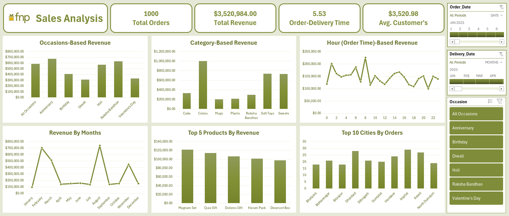

# FNP Sales Analysis Dashboard

## 📊 Project Overview

This project is an interactive **Sales Analysis Dashboard** built using **Microsoft Excel**. It provides a comprehensive view of sales performance for FNP by analyzing orders, revenue, customers, products, occasions, time trends, and geographic distribution.

The dashboard is designed to support **data-driven decision-making** by presenting key business metrics and insights in a clear and visually engaging format.

---

## 🎯 Objectives

* Analyze overall sales performance and revenue trends
* Identify top-performing occasions, product categories, and products
* Understand customer spending behavior
* Track order and delivery efficiency
* Discover high-performing cities and regions

---

## 📌 Key Metrics

* **Total Orders:** 1,000
* **Total Revenue:** $3,520,984
* **Average Customer Spend:** $3,520.98
* **Average Order-to-Delivery Time:** 5.53 days

---

## 📈 Dashboard Insights

* **Occasion-Based Revenue:** Anniversary, Raksha Bandhan, and Holi are the highest revenue-generating occasions.
* **Category-Based Revenue:** Colors, Soft Toys, and Sweets lead in revenue contribution.
* **Monthly Trends:** Revenue peaks during February and August, highlighting strong seasonal demand.
* **Hourly Order Trends:** Higher revenue is observed during early morning and late afternoon hours.
* **Top Products:** Magnam Set and Quia Gift are the top revenue-generating products.
* **Top Cities:** Imphal, Dhanbad, and Kavali record the highest number of orders.

---

## 🛠 Tools & Technologies

* **Microsoft Excel**

  * Power Query
  * Pivot Tables & Pivot Charts
  * Slicers & Timelines
  * Data Modeling & Calculated Fields

---

## 🗂 Dataset

* Sales order data including:

  * Order & delivery dates
  * Product categories and products
  * Occasions
  * Revenue and customer details
  * City-level order data

---

## 📷 Dashboard Preview

---

## 🚀 How to Use

1. Download the Excel file from this repository
2. Open it using **Microsoft Excel (2019 or later recommended)**
3. Use slicers and timelines to filter data by:

   * Order Date
   * Delivery Date
   * Occasion
4. Explore insights interactively

---

## 📌 Key Learnings

* Building end-to-end dashboards in Excel
* Using Power Query for data cleaning and transformation
* Creating interactive visuals for business insights
* Applying KPIs to support executive-level analysis

---

## 🤝 Connect

If you found this project useful or have suggestions for improvement, feel free to connect with me on **LinkedIn** or explore my other projects on **GitHub**.

👉 [LinkedIn Profile](https://www.linkedin.com/in/hadeeraltabaajuniorwebdeveloper)
